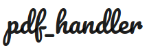

<h1 align="center">
  <br>
  
</h1>

<h4 align="center">A single page app based on <a href="https://www.djangoproject.com/" target="_blank">Django</a>.</h4>


pdf_handler is a django based single page application. pdf_handler helps you to merge multiple PDFs. It is simple and easy to use.

## Demo


## Motivation
pdf_handler is a single page application to help merge multiple PDFs in one go. Multiple websites has motivated me to build this project i.e. single functionality of merging the PDFs. 
 

## Tech/framework used

<b>Built with</b>
- [Django](https://www.djangoproject.com/)
- [Python]()
- [Javascript]()
- [Jquery]()


## Features
- Merge Multiple PDFs into one.
- Total Upload size upto 25 MB.
- Option of removing PDFs from the Queue.
- Files stored only on intermmediate basis, on page reload data is removed from the app.

## How to use?
Steps to run the application:
```
python manage.py makemigrations pdfApp
python manage.py migrate pdfApp
python manage.py runserver
```

## License
MIT © [keyurparalkar](https://github.com/keyurparalkar)
